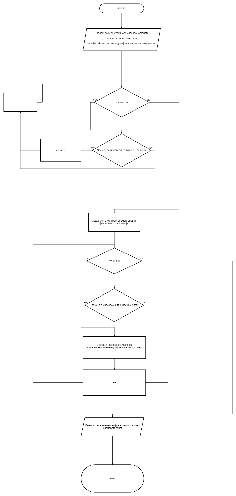

# Письменное решение задачи

1. Определим исходный строчный массив. Его размеры (*amount*) и каждый отдельный элемент.
2. Посчитаем кол-во элементов в исходном массиве с длинной 3 и менее.
3. Зададим финальный массив с размером равным количеству таких элементов (*count*).
4. Заполним финальный массив элементами с длинной 3 и менее.
5. Выведем все элементы массива при помощи for.

**Блок-схема решения**

